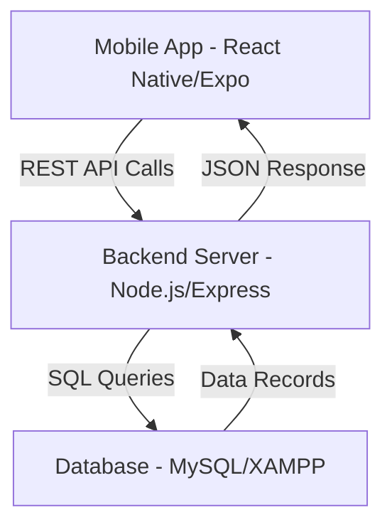

# 💳 Expense Tracker Pro

A high-performance, visually stunning Expense Management application built with **React Native (Expo)** and a robust **Node.js/MySQL** backend. This application features a modern "Emerald Slate" design language, real-time data synchronization, and advanced spending analytics.

---

## 🚀 Key Features

- **💎 Premium Glassmorphic UI**: A dark-themed, modern interface using HSL tailored colors and linear gradients.
- **📊 Detailed Spending Insights**: Beautiful bar charts and category breakdowns using `react-native-chart-kit`.
- **🔄 Real-time Synchronization**: Pull-to-refresh functionality integrated with a live XAMPP MySQL database.
- **📱 Responsive Layout**: Optimized for all mobile device sizes with safe area handling.
- **☁️ Full-Stack Architecture**: Independent Node.js Express server with relational database mapping.

---

## 🏗️ Project Architecture

The application follows a classic **M-V-C** inspired full-stack architecture:



### 🛠️ Technology Stack
- **Frontend**: React Native, Expo SDK 54, Expo Linear Gradient, Vector Icons.
- **Backend**: Node.js, Express.js, MySQL2, CORS.
- **Database**: MySQL (XAMPP), Relational Schema with `transactions` and `insight` tables.

---

## 📸 App Preview

| Transacton | Spending Insights | Dashboard |
|---|---|---|
|  |  |  |

---

## ⚙️ Setup Instructions

### 1. Database Setup (XAMPP)
1. Open **XAMPP Control Panel** and start **Apache** and **MySQL**.
2. Go to `phpMyAdmin` and create a database named `beautify petals_db`.
3. Import the `setup_database.sql` file located in the `backend/` folder.

### 2. Backend Installation
```bash
cd backend
npm install
node server.js
```

### 3. Frontend Installation
1. Update `src/api/apiConfig.js` with your computer's local IP address.
2. Run the following:
```bash
npm install
npx expo start
```

---

## 📂 Project Structure
```text
Task4/
├── assets/             # Images and Icons
├── backend/            # Express Server & SQL Scripts
│   ├── server.js
│   └── setup_database.sql
├── screens/            # UI Components
│   ├── ExpenseDashboard.js
│   └── ExpenseReports.js
├── src/                # Shared utilities
│   └── api/apiConfig.js
├── App.js              # Root Navigation
└── app.json            # Expo Config
```

---

## 👤 Developer
**Rukhsar**  
*Full Stack Developer | UI/UX Enthusiast*
